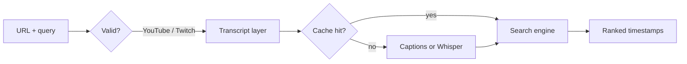

# Super Search

**Find the exact moment in a long video — by searching what was said.**

Super Search is a Python backend that takes a YouTube or Twitch URL and a plain-language query (`"boss fight"`, `"pricing discussion"`, `"funny moment"`) and returns ranked timestamps with confidence scores and excerpt text. No scrubbing through hours of footage.

[](https://github.com/Cincinnatus101010/supersearchvods/actions/workflows/ci.yml)


---

## The problem

Long-form video is hard to navigate. Titles and descriptions rarely describe what actually happens on stream. Editors, creators, and researchers waste time scrubbing multi-hour VODs looking for one quote, joke, or topic.

## What I built

A full search pipeline with two interfaces — CLI and REST API — that automates transcript retrieval, relevance ranking, and timestamp delivery.

| | |
|---|---|
| **Input** | Video URL + search phrase |
| **Output** | Ranked hits with `start`, `end`, `score`, and context excerpt |
| **Platforms** | YouTube, Twitch VODs, live channels, clips |

**Example CLI run**

```bash
uv run supersearch "https://www.youtube.com/watch?v=VIDEO_ID" "funny moment"
```

```
  1  0:05 → 0:15  score 0.82
     …this funny moment is great…
     https://www.youtube.com/watch?v=VIDEO_ID&t=2

  2  1:00 → 1:10  score 0.76
     …another funny moment at the end…
     https://www.youtube.com/watch?v=VIDEO_ID&t=57
```

---

## Architecture



1. **Validate** — Accept only YouTube and Twitch URLs; reject everything else early.
2. **Transcript** — Check disk cache → fetch auto-captions via yt-dlp → fall back to faster-whisper speech-to-text.
3. **Search** — Slide 30-second windows across the transcript; score by token overlap, term frequency, and exact phrase match.
4. **Return** — Top N non-overlapping hits with clip-friendly buffers and shareable timestamp links.

Twitch sources default to Whisper (captions are often missing). YouTube typically uses free captions first, keeping most runs fast.

---

## Highlights for reviewers

**Backend engineering**
- Typed Python modules with clear boundaries: `core` (parsing + ranking), `service` (orchestration), `api` (HTTP), `cli` (terminal)
- Packaged install with `supersearch` and `supersearch-api` entry points
- Disk-backed transcript cache — repeat queries on the same VOD skip re-download

**API design**
- FastAPI REST service with OpenAPI docs at `/docs`
- Server-Sent Events (SSE) for long-running jobs — clients see progress during caption fetch, audio download, and transcription
- Structured error responses and input validation

**External integrations**
- yt-dlp + ffmpeg orchestration via subprocess with timeouts and env-based configuration
- Optional faster-whisper with parallel audio chunking for hour-long videos

**Search & ranking**
- Custom relevance scoring — not a generic full-text database
- De-duplicated time windows so results spread across the video instead of clustering

**Quality**
- **59 automated tests** — parsers, ranking, cache, API validation, CLI behavior
- Test data factories for maintainable fixtures
- ruff linting + GitHub Actions CI on every push to `main`

---

## Tech stack

| Layer | Tools |
|-------|--------|
| Language | Python 3.12+ |
| API | FastAPI, Uvicorn |
| Media | yt-dlp, ffmpeg |
| Speech (optional) | faster-whisper |
| Packaging | uv, setuptools |
| Testing | pytest, httpx, test factories |
| Linting | ruff |

---

## Quick start

**Requirements:** Python 3.12+, [uv](https://docs.astral.sh/uv/), ffmpeg on `PATH`.

```bash
git clone https://github.com/Cincinnatus101010/supersearchvods.git
cd supersearchvods
uv sync
uv sync --extra whisper   # only for speech-to-text fallback
```

### CLI

```bash
# Search (positional or flags)
uv run supersearch "https://www.youtube.com/watch?v=VIDEO_ID" "your phrase"

# JSON output for scripting
uv run supersearch --json -q URL "phrase"

# Cache management
uv run supersearch cache list
uv run supersearch cache clear URL
```

### API

```bash
uv run supersearch serve --port 8000
# Interactive docs → http://localhost:8000/docs
```

```bash
curl -N -X POST http://localhost:8000/api/super-search \
  -H "Content-Type: application/json" \
  -d '{"url":"https://www.youtube.com/watch?v=VIDEO_ID","query":"your phrase"}'
```

The API streams progress events, then returns a final JSON payload with timestamps and excerpts.

---

## Project structure

```
src/
  core.py      # Caption parsing, Whisper, search ranking
  service.py   # Pipeline orchestration
  api.py       # HTTP layer + SSE streaming
  cli.py       # Terminal interface
  cache.py     # Persistent transcript storage
  urls.py      # Platform URL validation
tests/
  factory.py   # Test data builders
  test_*.py    # Unit + integration tests
```

---

## Testing

```bash
uv sync --group dev
uv run pytest          # 59 tests, no network required
uv run ruff check src tests
```

CI runs lint + full test suite on every push to `main`.

---

## Configuration

See `.env.example` for optional settings:

| Variable | Purpose |
|----------|---------|
| `SUPERSEARCH_YTDLP_COOKIES` | Cookie file for age-restricted or login-required videos |
| `SUPERSEARCH_CACHE_DIR` | Custom cache location (default: `~/.supersearch/transcripts`) |
| `SUPERSEARCH_WHISPER_MODEL` | Whisper model size (default: `base`) |

---

## License

MIT
